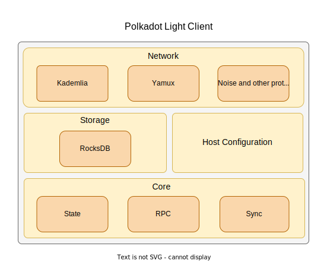

# Java Host Light Client High-Level Design

# Background

In the context of blockchain ecosystems, light clients are important because they provide a lightweight and efficient way for users to access and interact with the blockchain. Due to the removal of the requirements for the users to download the entire blockchain, they can be used on devices with limited storage or processing power. This makes them ideal for a wide range of applications, including accessing and managing blockchain assets, developing decentralized applications (dApps), and providing a simple and user-friendly way for users to get started with a blockchain.

Additionally, light clients can help support blockchain technology's growth and adoption. By providing a simple and convenient way for users to access and interact with a blockchain, light clients can help to make blockchain technology more accessible to a wider audience. This can help to drive the development of new applications and use cases for blockchain technology, and can ultimately help to support the growth and success of the blockchain ecosystem.

With this document, the team at LimeChain proposes a design for the creation of a Java Polkadot light client.

# Design Overview

The light client will be the stepping stone for the Java Host. Its main objective is to follow the chain through the p2p protocol, query information from other nodes on the network and verify their authenticity locally. It does not maintain the full state, but rather queries the full node on the latest finalized state and verifies the authenticity of the responses trustlessly.

Although the sync and state logic of the light client differs from the other node types, the design of the light client will shape the general architecture of the Host and implement the requirements based on the [Polkadot Specification section](https://spec.polkadot.network/#sect-requirements-lightclient).

No overhead should be added to the light-client architecture. Instead, developers should mindful that there’s going to be more functionality coming from the full and authoring node specification. By doing so, it allows the light client to build a solid foundation for the general host architecture and seamlessly transition from a light client to full node requirements without any refactoring and complications.

## Network

The light client is a mostly passive participant in the protocol. However, it’s an active participant in the p2p network and as such it must implement most of the networking protocols. A networking module is to be created which encapsulates these protocols and their accompanying methods.

[Kademlia](https://github.com/libp2p/specs/blob/master/kad-dht/README.md) is to be used as a peer discovery protocol. Its content-providing capabilities are not an interest of the Polkadot Host. After the module is initialised the host will start sending periodic Kademlia peer discovery requests, gradually expanding the Host’s knowledge of its peers. This enables [Noise](https://github.com/libp2p/specs/blob/master/noise/README.md) and [Yamux](https://github.com/libp2p/go-yamux/blob/master/spec.md) protocols to kick in and start sending and processing encrypted substreams.

The networking protocols and the discovered peers enable all subsequent functionality of the Light-Client such as:

- Querying peers for the latest chain state
- Relaying RPC requests and messages to peers
- Processing messages coming from peers over Yamux

## Persistence

Light Client and Hosts in general need a fast key-value persistance layer and [RocksDB](http://rocksdb.org/) is an excellent candidate for that in the context of a Java Host. [Substrate](https://github.com/paritytech/substrate), [Besu](https://github.com/hyperledger/besu), [NEAR](https://github.com/near/nearcore) and other blockchain protocols already use it for their state storage. There is also a lot that RocksDB offers in terms of read/write [performance tuning](https://www.researchgate.net/publication/338945111_Optimizing_RocksDB_for_Better_Read_Throughput_in_Blockchain_Systems). Developers should be careful to not degrade performance with the tuning though. RocksDB is actively developed and has a big community. Finally, it has a native(developed in-house) [Java API](https://github.com/facebook/rocksdb/tree/main/java/src/main/java/org/rocksdb) which makes it an even more attractive option.

### State

The light client will update its state to reflect the latest view of the blockchain by querying the full nodes. This requires it to store only a fraction of the information that a full node has to possess.

Having the persistence layer with RocksDB ready, the light client will store the latest finalized block state and known peers at the time of disconnection. This persisted state enables the client to easily pick up from where it left off. Peers known for a long time are more reliable [[1]](https://www.notion.so/Java-Host-Light-Client-High-Level-Design-b25d4cec0a4f4d3bbc299e867bd81876). Thus saving known peers allows the client to not only quickly reconnect to them without waiting for the peer discovery protocol but also to connect to more reliable ones.

## Sync

The syncing module should grow as progress is done towards the light and full node implementations. That’s why we advise it to be a separate encapsulated module. For the light client, developers should implement warp and fast sync. Since the development team is going to have to implement GRANDPA justification verification, it can implement warp sync in order for the node to sync in the fastest way possible.

### Finalized Justifications

The light client listens for new finalized blocks and [verifies justifications](https://spec.polkadot.network/#defn-finalizing-justification). It computes the authority set for a given block and checks if more than 2/3 valid GRANDPA justification signatures are in the [justification message](https://spec.polkadot.network/#defn-grandpa-justification). If verification is successful, the block will be stored in the light client as the latest finalized block state.

## RPC API

The JSON RPC part of the node is a well-encapsulated module. By design, it exposes two sets of endpoints - public and private(unsafe). Each of them exposes two types of endpoints - for RPC/TCP and RPC/WebSocket as specified in [PSP-6](https://github.com/w3f/PSPs/blob/master/PSPs/drafts/psp-6.md).

The light client processes legacy RPC method requests from PSP-6 but also implements the new ones from the [JSON-RPC specification](https://paritytech.github.io/json-rpc-interface-spec/).

### Queues

In order to achieve good performance and scalability, the response time of the API must be short. To achieve this, the CPU operations and I/O operations have to handle requests but not take too much time. The only way to guarantee this is by limiting the number of CPU or I/O operations that can be performed concurrently.

The way we recommend resolving that is by using queues for RPC method executions. These queues will be further split into heavy-weight and light-weight groups (throttles) for each type of RPC request. It should be pointed out that dispatching notifications for example new blocks will not be delayed. A limit on the number of active WebSocket subscriptions is to be added as well.

### Framework

The JSON-RPC framework itself is to be implemented using ‣ or the development team can do the implementation itself if they notice that it doesn’t suit their needs or adds too much overhead. Additionally, the JSON-RPC API will be made available over the WebSocket Protocol.

### Methods

The light client doesn’t have to implement almost any RPC methods but rather forward requests to a full node that can process them. Exceptions are the methods from the `system` namespace which return information about the light client and it’s peers. In addition to the methods in PSP-6 the light client will support the following methods:

- `rpc_methods`
- `chainHead_unstable_follow`
- `chainHead_unstable_unfollow`
- `chainHead_unstable_unpin`
- `chainHead_unstable_storage`
- `chainHead_unstable_call`
- `chainHead_unstable_stopCall`
- `transaction_unstable_submitAndWatch`
- `transaction_unstable_unwatch`

### Method Aliases

Some RPC methods have endpoint aliases. Some of them are specified in PSP-6, some however are not and can only be found in the Substrate code base. The described implementation follows the aliases specified in Substrate as It’s more recently updated than PSP-6.

# Testing

In order to ensure and showcase the correct operation of the light client a full range of unit tests for each module should be implemented.

# Conclusion

Light clients are a crucial component in the transition towards a full node in a blockchain network. They offer numerous benefits to the end user by allowing them to participate in the network and access its services without having to store the entire blockchain data on their devices. The use of light clients also helps to establish the base architecture of a full node.

# References

[1] [https://pdos.csail.mit.edu/~petar/papers/maymounkov-kademlia-lncs.pdf](https://pdos.csail.mit.edu/~petar/papers/maymounkov-kademlia-lncs.pdf) Fig. 3
