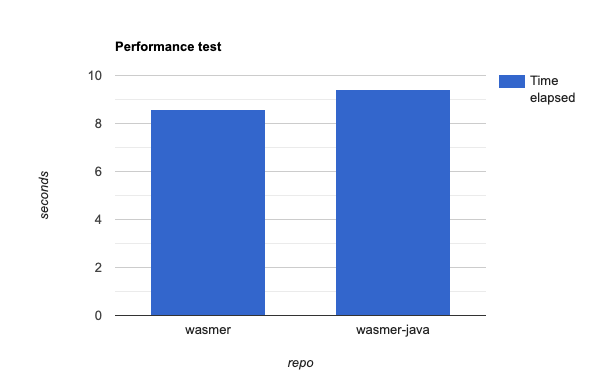

# Java Host Research Outcome

# Background

Polkadot’s Host diversity ecosystem has already started expanding with [Gossamer](https://github.com/ChainSafe/gossamer) and [Kagome](https://github.com/soramitsu/kagome) leading the way as alternatives to the official Rust Host implementation. They proved that diversification is possible and important for Polkadot’s ecosystem.

Java is known to have a strong community and has proven over time that it can provide high-performance and scalable solutions to the world. It has already been shown to be beneficial to Ethereum’s ecosystem diversity with [Besu](https://github.com/hyperledger/besu) and [Teku](https://github.com/ConsenSys/teku) gaining adoption [respectively 18% and 6%](https://clientdiversity.org/) of the Ethereum 2.0 Clients’ share at the time of writing. Adding Java as a Host language will bring the attention of Java communities (enterprises comprise a high percentage of it) and ecosystems to Polkadot which we think is going to be beneficial to both sides.

In order to lay out the design of the Java Polkadot Host, our team set out on a mission to find out and research what challenges would that achievement provide us with. The main goal of this document is to answer the question of whether it is feasible to implement a Host in Java and at what cost.

# Introduction

Using Java as a language to develop an alternative Polkadot Host sounds compelling because of Java’s history of being a high-achiever in terms of community, library diversity and stability.

We focused on clearing out uncertainties in several aspects. Those mainly included Host components that can pose a big risk to the feasibility of the project such as:

- Is there a suitable WASM runtime execution environment?
- Are there missing functionalities within the p2p stack?
  - Assess the implementation effort of Kademlia and Yamux
- Are there crypto primitives used in Polkadot that are not available in Java?

As an answer to the first topic (WASM Execution Environment), we describe the technical challenges we went through and showcase a PoC of a forked and patched version of [wasmer-java](https://github.com/LimeChain/wasmer-java) that is suitable for being used within a Polkadot Host.

Assuming all risks and challenges are surmountable we outline the high-level functionality and design of a light client and authoring node that will serve as a blueprint for future work.

<aside>
ℹ️ **Note:** Design documents are not present in this research document.

</aside>

As sources of truth, we used first and foremost [the Polkadot specification](https://spec.polkadot.network). As implementation examples, we actively examined [Substrate](https://github.com/paritytech/substrate), [Smoldot](https://github.com/paritytech/smoldot), [Kagome](https://github.com/soramitsu/kagome) and [Gossamer](https://github.com/ChainSafe/gossamer)’s implementations in order to have the best clarity for some protocol details.

# Research Items

## WASM Execution Environment

The Host can be looked at as a [Discrete State Machine](https://spec.polkadot.network/#defn-state-machine) meaning that it has the functionality to transition from one state to another. However, the Host is blind to how the state-altering instructions are created. This responsibility is delegated to the Polkadot Runtime.

The Host and the Runtime exist in symbiosis meaning that they can’t function without one another. The way they communicate is using two main patterns - Host and Runtime APIs and shared memory buffer.

### Host & Runtime APIs

In general, all data exchanged between the Polkadot Host and the Runtime is encoded using the [SCALE codec](https://docs.substrate.io/reference/scale-codec/). Therefore all runtime entry points have the following identical WAT function signature:

```rust
(func $runtime_entrypoint (param $data i32) (param $len i32) (result i64))
```

When the WASM method, corresponding to the entry point, is invoked, two integers are passed as arguments. The first argument `$data` is set to the memory address of the byte array in WASM memory. The second argument `$len` sets the length of the encoded data stored in that memory. The return value `result` which is returned from the invocation is an integer(Long in Java), representing two consecutive integers in which the least significant one indicates the pointer to the offset of the result returned by the entry point encoded in SCALE codec in the memory buffer. The most significant one provides the size of the blob.

This specification creates several research tasks for the Java WASM Execution Runtime that have to be verified or disproved:

- [ ] Load `wasm` (WebAssemblyMVP) bytecode for execution
- [ ] Import Host APIs within the Runtime
- [ ] Allocate/Deallocate memory buffer for transferring data between Host <> Runtime
- [ ] Set data in the shared memory buffer for sending data to Runtime
- [ ] Load `__heap_base` exported from the `WASM` runtime
- [ ] Call exported from the WASM Bytecode function with data arguments
- [ ] Verify that all `crypto` / `hashing` primitives are implemented or can be implemented in Java
- [ ] Read and parse the returned data of the WASM Runtime from the shared memory buffer

**PoC repo [here](https://github.com/LimeChain/wasmer-java)**

### Findings

The research left us with the following **positive findings**:

- `wasmer-java` could be extended fairly easily once a person gets comfortable with the code;
- It is able to load a wasm runtime and use its memory and exports → Tested through having successfully loaded a wasm runtime and through having accessed the exported wasm memory and managed to read and write data through the memory buffer;
- It can import functions and memories → Tested through successfully importing both functions and memory to a wasm runtime. The functions were called successfully. Those imports were possible by extending the core functionality;
- It is not necessary to load `__heap_base` explicitly because you can access the memory buffer directly;
- Both exported and imported functions can be called;
- Due to using JNI, it has access to every possible rust crate;
- A following performance test was run → both `wasmer` and `wasmer-java` had to load a wasm runtime file with 2 imported functions and an imported memory. After that, both imported functions were called. This was done 100 times in a for loop and the execution times were as follows: `wasmer` - 8.6s, `wasmer-java` - 9.4s. This means that `wasmer-java` is only **9.3% slower** in the full cycle of loading, importing memory, execution and reading of output. This shows that the java library delivers the necessary performance for it to be used as an Execution Environment of Runtimes.



Here is a list of some of the **negative findings**:

- It’s not maintained or supported
- The original version of the repo doesn’t support imports of any kind. A PR is open which is adding support for importing functions into the wasm. We forked the repository in order to introduce additional functionality.
- There’s little to no information on the web about JNI and related problems
- Breaks Java’s platform independence due to using JNI (JNI makes use of dynamic libraries - `.so`, `.dylib`, `.dll`)
- Bintray (where it’s published as a package) is no longer operational

The proof of concept application using `wasmer-java` shows that executing `wasm` inside a Java runtime is certainly possible.

The next steps for `wasmer-java` are:

- [ ] Rework the `Memory` class so that it could be used for importing memory (it can currently only be used for exported memory). This means that the buffer that the `Memory` class provides, which is used for writing and reading data from/to the wasm, cannot (yet) be accessed if no memory is exported.
- [ ] Rework the function that instantiates the module with imports so that it doesn’t only expect functions within those imports
- [ ] Check out in-depth some of the comments left which indicate that there are some code improvements to be made
- [ ] Check whether the `wasmer` version needs to be updated (currently using 0.2.0 with 0.3.x being released)

## SCALE Codec

[SCALE](https://docs.substrate.io/reference/scale-codec/) is a lightweight and efficient encoding and decoding program to optimize how data is sent and received over the network. It’s a critical component for communication between the Runtime and the Host as well. As stated in the Host specification it should be used in all cases unless specifically stated not to. Therefore we had to research the feasibility of SCALE’s Java implementation:

- [ ] Verify whether PolkaJ’s SCALE module can be used in the Polkadot Host

### Findings

PolkaJ has good documentation showcasing how SCALE functionality can be used. Looking at the Substrate [documentation for SCALE](https://docs.substrate.io/reference/scale-codec/), it seems like it’s been based on the Rust implementation. Investigating the table with different types from the documentation shows that PolkaJ is missing some types - namely:

- `Result` for all types of primitive values
- `Option` for all primitive values except for boolean.

These issues are negligible as Result and Option are Rust-specific types and can be easily ported to Java. There are also a couple of issues logged in GitHub that we might need to resolve with PRs or by forking. All in all the issues mentioned are easily surmountable and PolkaJ’s SCALE will be very helpful during the development of a Java Host.

## Networking

The Polkadot Host being a node in a decentralized network relies on specific networking protocols. A lot of the Polkadot Host’s networking functionalities use different libp2p protocols that have already been implemented in the more mature [Rust](https://github.com/libp2p/rust-libp2p/), [Go](https://github.com/libp2p/go-libp2p) and [C++](https://github.com/libp2p/cpp-libp2p) protocols stacks.

Having a reliable network stack is of the utmost importance for the Host. A bug in the communication protocol with other nodes can result in the node being slashed.

The main protocols used in the Polkadot Host are:

- [Kademlia](https://github.com/f0lg0/kademlia-dht)
- [Yamux](https://github.com/libp2p/rust-libp2p/tree/master/muxers/yamux)
- [Noise](https://github.com/libp2p/rust-libp2p/tree/master/transports/noise)
- [Protobuf](https://github.com/protocolbuffers/protobuf)
- [Addressing & Peer ID](https://github.com/libp2p/rust-libp2p/)

### Findings

[jvm-libp2p](https://github.com/libp2p/jvm-libp2p)’s protocol stack is in development and is prioritising protocols required for Ethereum 2.0 Clients to function. Noise, PeerId and other accompanying protocols are already implemented and our research shows that they can be used in a Java Host. That being said there are two big protocols that are missing.

### **Kademlia**

Kademlia is a DHT Protocol that’s used for peer discovery in the context of Polkadot Hosts. It comes with a few implementation flavours and libp2p has its own unique one described in its [specification](https://github.com/libp2p/specs/blob/master/kad-dht/README.md). There are several existing Kademlia JVM implementations that are not quite production-ready and don’t comply with libp2p’s specifications.

Kademlia isn’t used in Ethereum 2.0 Clients, meaning it isn’t on libp2p’s development roadmap for the near future. This was also confirmed by communicating with the team supporting the library.

That being said we’ve scoped and estimated the effort for us to contribute Kademlia implementation to the JVM-libp2p repo [here](./libp2p-kademlia-for-jvm-scope-estimation.md).

### Yamux

Yamux is a multiplexing protocol also used in the context of Polkadot Hosts to exchange messages over several substreams. Protocol Labs have said that they have Yamux in their roadmap but it isn’t clear at what point the implementation will be started and completed.

That’s why we’ve also scoped and estimated the effort it would take for us to add Yamux to jvm-libp2p [here](./libp2p-yamux-jvm-scope-estimation.md).

## Cryptographic primitives

As with every blockchain protocol, Polkadot uses a lot of cryptographic primitives. A list of crypto primitives was gathered using the information in the Polkadot spec as well as by looking at the existing Rust, Go and C++ implementations of the Host.

### Findings

Our findings on this topic are primarily positive. Most of the crypto primitives have multiple implementations in Java. There are a few missing implementation details in some of them but we think that it is feasible to contribute the missing code. In the sections below we describe those functionalities.

**Schnorr**

In Polkadot, VRFs are used for the [BABE block production lottery](https://spec.polkadot.network/#algo-block-production-lottery) and the [parachain approval voting mechanism](https://spec.polkadot.network/#sect-approval-voting). VRFs use a mechanism that essentially generates a deterministic elliptic curve based on Schnorr signature as a verifiable random value.

We took a look at 3 libraries that provide Schnorr functionality in Java - [PolkaJ](https://github.com/emeraldpay/polkaj/tree/master/polkaj-schnorrkel), [polkadot-java](https://github.com/polkadot-java/api/tree/master/sr25519), [schnorrkel-java](https://github.com/debuggor/schnorrkel-java). PolkaJ uses JNI to execute either the rust implementation of sr25519 whereas polkadot-java uses JNI and the C++ implementation. Schnorrkel-java has taken the native implementation approach instead of using JNI bindings. PolkaJ and polkadot-java are missing the STROBE128 transcript and operations functionality which is required for the BABE block production lottery algorithm. Schnorkell-java has STROBE128 functionality implemented but has missed out on implementing generation and proving of DLEQ proofs.

**DLEQ Proofs**

DLEQ stands for “discrete log equivalence proof”. They are proofs part of the VRF functionality required for BABE block production lottery algorithm. The Polkadot specification is referring to [this article](https://blog.cloudflare.com/privacy-pass-the-math/#dleqproofs) as an explanation of why DLEQ proofs are used, how they work and how protocols benefit from them. Our team is interested in the application of DLEQ proofs in the context of the BABE lottery algorithm. Since schnorkell-java has not been maintained for more than 2 years and it’s based on rust’s [schnorkell](https://github.com/w3f/schnorrkel) library the most sensible way forward is to look at Rust’s schnorkell implementation and port it over to schnorkell-java.

| Library          | sr25519 implementation                                                | STROBE128 functionality | DLEQ Proofs |
| ---------------- | --------------------------------------------------------------------- | ----------------------- | ----------- |
| PolkaJ           | Bindings for https://github.com/w3f/schnorrkel                        | No                      | No          |
| Polkadot-java    | Bindings for https://github.com/polkadot-java/api/tree/master/sr25519 | No                      | No          |
| Schnorkrkel-java | Native Java implementation                                            | Yes                     | No          |

As a conclusion, we can say that the most feature-rich library is schnorkel-java. We recommend using it for the Polkadot Host although DLEQ generation and proving have to be implemented since they are part of the BABE functional requirements.

**XXHash(Twox)**

[XXHash](http://cyan4973.github.io/xxHash/) is a fast hash algorithm which produces hashes identical across all platforms (little/big endian). XXHash is used in the Host in order to expose 3 host functions to the runtime. These functions use 64, 128 and 256-bit hashing.

We took a look at two possible twox implementations that can be used. The first one is from [lz4-java](https://github.com/lz4/lz4-java/tree/master/src/java/net/jpountz/xxhash)’s repo which includes the following algorithms:

- XXH32 : generates 32-bit hashes, using 32-bit arithmetic
- XXH64 : generates 64-bit hashes, using 64-bit arithmetic

This means that the existing functionality has to be extended with 128 and 256 functionality. [Another Java twox implementation](https://github.com/OpenHFT/Zero-Allocation-Hashing/blob/ea/src/main/java/net/openhft/hashing/XXH3.java) exists that utilizes XXH3 which is a new variant of the XXHash and is said to be faster. The second alternative supports 128-bit hashing but is missing the 256-bit one.

Whichever implementation is decided to be used for a Java Host, implementing the 128 and/or the 256-bit function shouldn’t be a problem that poses a big risk to the feasibility of the Host.

## Maintenance and contributions to dependencies

A recurring scenario that our team found itself in was looking at dated or abandoned repos - wasmer-java, polkaj and jvm-libp2p being the most important ones. This could pose a threat to the stability of the Java Host as fixes and patches have to be performed in those libraries in case bugs are found.

The 2nd biggest if not the biggest part of a Host is its networking module. We already mentioned that Kademlia and Yamux are not implemented. However, there’s another risk. jvm-libp2p is being worked on but based on the commits it seems that the rate of work is not very fast and productive. The last bug fix was on [19th August 2022](https://github.com/libp2p/jvm-libp2p/commit/8a41192ea996a159416bdf4ec442ef53b3496092) which raises questions as to how reliable the stack can be for the Polkadot Host. We also couldn’t find many applications that utilize the jvm-libp2p stack to serve as a reliable example.

A small risk worth mentioning as an example is that there’s [this issue](https://github.com/libp2p/jvm-libp2p/issues/263) submitted 3 weeks ago which is directly tied to the [Peer Id definition](https://spec.polkadot.network/#defn-peer-id) from the specification. If the team was to contribute the fix to that issue, can we count on jvm-libp2p’s development team to assist us with some guidance to pinpoint the issue? This will be added in the discussion section below.

## JSON RPC API

The JSON RPC API is another big part of the node. It should be able to either relay those requests to full nodes in the context of light clients or process those requests in the case of full and authoring nodes. We looked at [PSP-6](https://github.com/w3f/PSPs/blob/master/PSPs/drafts/psp-6.md) and the newer and still work-in-progress [JSON RPC interface specification](https://github.com/paritytech/json-rpc-interface-spec).

### Findings

Our research wasn’t able to find any potential issues with implementing the JSON RPC API part of the Host. The JSON RPC framework itself can be implemented using ‣ or the team can do the implementation natively if the library does not suit the needs or adds too much overhead.

### **DoS attacks resilience**

As explained in a great deal in the new JSON RPC specification, it’s highly recommended that the JSON RPC module has DoS attack protections. We’ve acknowledged that and have added a section with implementation details regarding this topic in the design documents for the light client and the authoring node in the section mentioned below.

### Method Aliases

Some RPC methods have endpoint aliases. Some of them are specified in PSP-6, some however are not and can only be found in the Substrate code base. Our implementation will follow the aliases specified in Substrate as It’s more recently updated than PSP-6.

We’re confident that although being part of the Host, aliases are not going to pose any risks to a Java Host implementation.

# Summary

Polkadot Hosts’ architecture and specification are complex. They depend on a variety of protocols, crypto primitives and libraries. Our research was set out on a mission to investigate all of the critical foundational pieces of a Host. We had a productive outcome in the sense that we managed to find some parts that are ready to be implemented and some problematic parts that have to be addressed.

- Wasmer-java has a few missing functionalities that can be easily implemented (we’ve added some of them in our PoC). Nevertheless, it’s a promising runtime that can be used for the Host’s purposes
- JVM-libp2p’s protocol stack has to be extended with Kademlia and Yamux
- Some cryptographic primitives are missing functionalities which can be added during the development
- Our team didn’t find any risks or uncertainties in implementing Storage/persistence and our advice would be to RocksDB for the Host’s storage
- Our team didn’t find any risks regarding the RPC API

# Discussion

- One risk of using the JVM libp2p implementation is the uncertainty of whether features such as Kademlia and Yamux will be accepted by the library maintainers and pushed upstream. The same is true for issues that are found in the library (not only missing functionality) during the development of the Host. The question is - Can one rely on the development team that those features/bug fixes will be included upstream?

# References

- [https://docs.substrate.io/](https://docs.substrate.io/)
- [https://github.com/w3f/polkadot-spec](https://github.com/w3f/polkadot-spec)
- [https://github.com/paritytech/substrate](https://github.com/paritytech/substrate)
- [https://github.com/paritytech/smoldot](https://github.com/paritytech/smoldot)
- [https://github.com/ChainSafe/gossamer](https://github.com/ChainSafe/gossamer)
- [https://github.com/soramitsu/kagome](https://github.com/soramitsu/kagome)
- [https://github.com/w3f/PSPs/blob/master/PSPs/drafts/psp-6.md](https://github.com/w3f/PSPs/blob/master/PSPs/drafts/psp-6.md)
- [https://github.com/libp2p/jvm-libp2p](https://github.com/libp2p/jvm-libp2p)
- [https://github.com/emeraldpay/polkaj/tree/master/polkaj-schnorrkel](https://github.com/emeraldpay/polkaj/tree/master/polkaj-schnorrkel)
- [https://github.com/polkadot-java/api/tree/master/sr25519](https://github.com/polkadot-java/api/tree/master/sr25519)
- [https://github.com/debuggor/schnorrkel-java](https://github.com/debuggor/schnorrkel-java)
- [https://github.com/lz4/lz4-java/tree/master/src/java/net/jpountz/xxhash](https://github.com/lz4/lz4-java/tree/master/src/java/net/jpountz/xxhash)
- [https://github.com/libp2p/specs/blob/master/kad-dht/README.md](https://github.com/libp2p/specs/blob/master/kad-dht/README.md)
- [https://github.com/libp2p/go-yamux/blob/master/spec.md](https://github.com/libp2p/go-yamux/blob/master/spec.md)
