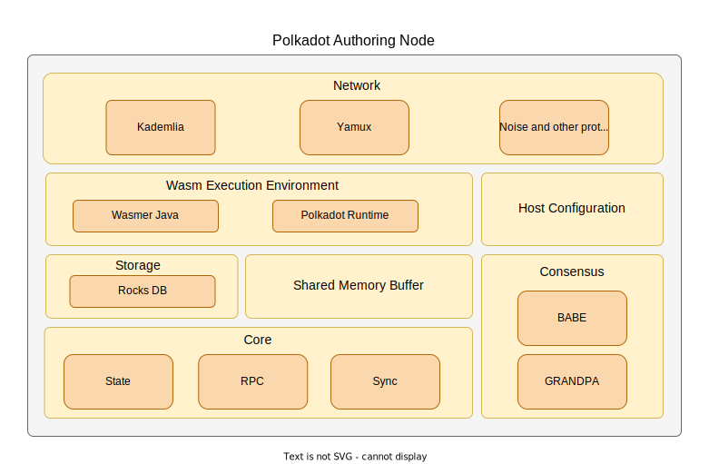

# Java Polkadot Host High-Level Design

# Introduction

As a prerequisite, it’s recommended going through [Java Host Light Client High-Level Design](./java-host-light-client-high-level-design.md).

## Design Overview

Design of the Full & Authoring Polkadot Node builds on top of the foundation of the light client. In this document, the major differences between the Full & Authoring Polkadot Node are outlined and a sensible design for both of them is proposed.

As seen from the diagram there are a few new modules compared to the Light Client design document. Wasm Execution Environment, Shared Memory Buffer and Consensus are modules that are present in full and authoring nodes. They will be discussed in the following sections, as well as all existing modules that are having their functionality upgraded.

## Network

The foundation of the network module has been laid out by the light client. For the bigger part of the improved network module, there are upgrades to the functionalities of the existing protocols:

- Yamux is extended with more substream implementations mentioned below.
- Kademlia protocol is upgraded so that the node maintains around 50 active peers.

## Storage

### Main & Child State Storage Trie

For storing the state of the system, Polkadot Hosts implement a hash table storage where the keys are used to access each data entry called the State Trie or Trie. The trie is a radix-16 tree where each key value identifies a unique node in the tree.

Developers should be aware that there’s an ongoing migration and discussion regarding [state trie version 0 and 1](https://github.com/paritytech/substrate/discussions/11607) which applies to all Host implmentations.

On a high level, the host must be able to perform these tasks in no specific order:

- Construct trie leaves & branches
- Transform trie leaves into branches
- Calculate merke value of a node and it’s children
- Update trie after executing extrinsics in the runtime
- Persist trie in a suitable key-value database
- Construct trie from database
- Implement [Storage Host API](https://spec.polkadot.network/#sect-storage-api) methods
- Implement [Child Storage Host API](https://spec.polkadot.network/#sect-child-storage-api) methods
- Implement [Trie Host API](https://spec.polkadot.network/#sect-trie-api) methods
- Implement [State RPC API](https://github.com/w3f/PSPs/blob/master/PSPs/drafts/psp-6.md#111-state) methods
- Implement [Child State RPC API](https://github.com/w3f/PSPs/blob/master/PSPs/drafts/psp-6.md#112-child-state) methods

### Off-chain Storage

The off-chain storage is also managed by [offchain Host](https://spec.polkadot.network/#sect-offchain-api) and [offchain RPC](https://github.com/w3f/PSPs/blob/master/PSPs/drafts/psp-6.md#110-offchain) APIs and must implement their respective methods. Additionally, it’s used by the Crypto and Author APIs and must implement all [Crypto Host API](https://github.com/w3f/PSPs/blob/master/PSPs/drafts/psp-6.md#112-child-state) and some of the [Author RPC API](https://github.com/w3f/PSPs/blob/master/PSPs/drafts/psp-6.md#18-author) methods:

- `author_insertKey`
- `author_hasKey`

The following off-chain storage typеs are available:

- **PERSISTENT** - is non-revertible and not fork-aware. It means that any value set by the off-chain worker is persisted even if that block (at which the worker is called) is reverted as non-canonical (meaning that the block was surpassed by a longer chain). The value is available for the worker that is re-run at the new (different block with the same block number) and future blocks. This storage can be used by offchain workers to handle forks and coordinate off-chain workers running on different forks.
- **LOCAL** - is revertible and fork-aware. It means that any value set by the offchain worker triggered at a certain block is reverted if that block is reverted as non-canonical. The value is NOT available for the worker that is re-run at the next or any future blocks.

### Cryptographic keys

Cryptographic keys are stored in separate key stores based on their intended use case. The separate key stores are identified by a 4-byte ASCII key type identifier. The following known types are available:

| acco | Key type for the controlling accounts      |
| ---- | ------------------------------------------ |
| babe | Key type for the Babe module               |
| gran | Key type for the Grandpa module            |
| imon | Key type for the ImOnline module           |
| audi | Key type for the AuthorityDiscovery module |
| para | Key type for the Parachain Validator Key   |
| asgn | Key type for the Parachain Assignment Key  |

# Wasm Execution Environment

The Host must be able to build and validate blocks, apply extrinsics, intrinsics and other functionalities in order to be able to correctly transition from one state to another. This is where the Wasm Execution Environment comes to play. The Host loads the latest runtime from the chain, imports host functions and uses it as a virtual machine environment. The environment is to be based on wasmer-java which provides all the necessary functionality for the Polkadot runtime to be executed.

## Shared Memory Buffer

Each function call into the Runtime is done with newly allocated memory (via the shared allocator), either for sharing input data or results. Arguments are SCALE encoded into a byte array and copied into this section of the Wasm shared memory. Allocations do not persist between calls. It is important to note that the Runtime uses the same Host provided allocator for all heap allocations, so the Host is in charge of the Wasm heap memory management. Data passing to the Runtime API is always SCALE encoded, Host API calls on the other hand try to avoid all encoding. \*\*\*\*

Wasmer-java comes with built-in memory-sharing functionality. The host is responsible for encoding the input data and passing it correctly to the runtime and decoding the results of runtime invocations

# Consensus-reaching process

Consensus in the Polkadot Host is achieved during the execution of two different procedures, block production and finality. The Polkadot Host must run these procedures if and only if it is running on an authoring node.

## Block Production

The Polkadot Host uses the BABE protocol for block production. It must conform to the BABE specification and incorporate several algorithms and messages. On a high level, the host must be able to perform these tasks in no specific order:

- Have block authoring session key pair(SR25519 key pair) that signs the produced block and computes its lottery values
- Detect equivocations committed by other validators and submit those to the Runtime
- Execute the block production lottery algorithm to identify the production slots it’s rewarded
- Execute the median time offset algorithm at the beginning of each epoch in order to estimate the local clock offset in relation to the network
- Execute the block production algorithm
- Execute the block-building algorithm
- Execute and verify produced block authorship right when the host receives a block
- **Generate DLEQ(VRF) Proofs**
  - Not implemented in any Schnorrkel Java library
- **Verify DLEQ(VRF) Proofs**
  - Not implemented in any Schnorrkel Java library.

### Substreams

One substream must be exposed for the block production:

- `/block-announces/1` - a substream/notification protocol which sends blocks to connected peers

### RPC Methods

The following RPC endpoints must be added:

- `babe_epochAuthorship`

## Finality

The Polkadot Host uses the GRANDPA Finality protocol to finalize blocks. Finality is obtained by consecutive rounds of voting by the validator nodes. Validators execute the GRANDPA finality process in parallel to Block Production as an independent service. On a high level the host must be able to perform these tasks in no specific order:

- Have an ED25519 key pair which is used during GRANDPA voting
- Generate justifications
- Broadcast justifications
- Detect equivocations committed by other validators and submit those to the Runtime
- Broadcast GRANDPA consensus messages
- Perform initial GRANDPA state sync
- Perform the rejoin same voter set sync algorithm
- Perform the voting process each round
- Detect and perform forced authority set changes
- Send and process catch-up requests by other GRANDPA voter nodes

### Substreams

One substream must be exposed for the finality process:

- `/grandpa/1` - a substream/notification protocol that sends GRANDPA votes to connected peers

### RPC Methods

The following RPC endpoints must be added:

- `grandpa_roundState`
- `grandpa_proveFinality`
- `grandpa_subscribeJustifications`
- `grandpa_unsubscribeJustifications`

## Testing

Full range of unit tests should be provided in order to showcase the correct operation of the Host. At this point, integration with [Polkadot Conformance Testsuite](https://github.com/w3f/polkadot-tests) can be considered in order to further increase the confidence in the reliability of the Polkadot Java Host.
